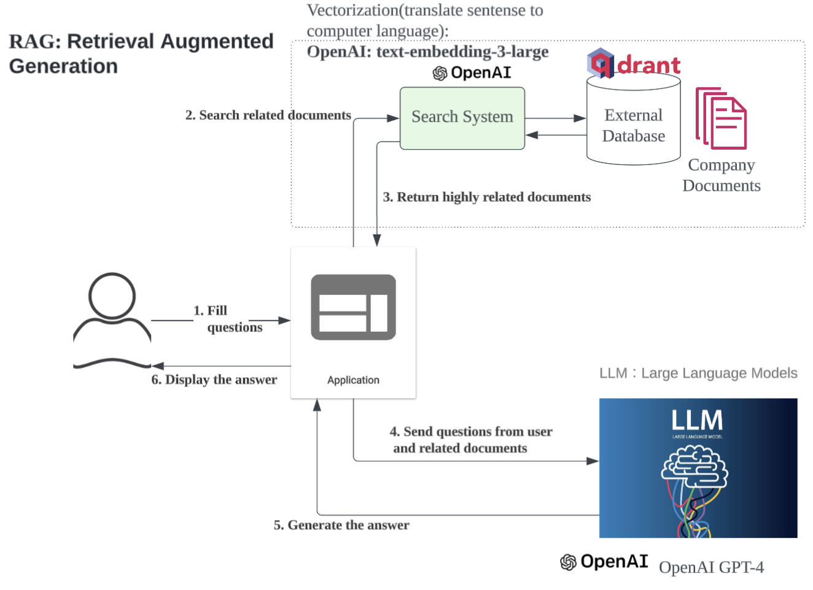

# RAG Q&A Application

An internal document Q&A system powered by Retrieval-Augmented Generation (RAG). Users type natural language questions and receive AI-generated answers grounded in Markdown documentation — with bilingual support for English and Japanese.

**[Live Demo](https://rag-git-main-maishis-projects.vercel.app/)**

## Features

- **RAG Pipeline** — Markdown documents are chunked, embedded with OpenAI `text-embedding-3-small`, and stored in Qdrant. On each query, the top-10 semantically similar chunks are retrieved and passed to GPT-3.5-turbo as context via LangChain.
- **Streaming Response with Typewriter Effect** — Answers stream character-by-character using the Web Streams API for a smooth UX.
- **Bilingual UI (EN / JA)** — Full i18n support via `next-intl`; users switch locale without a page reload.
- **Incremental Embedding** — Documents are UUID-hashed on ingestion, so only new content is added to the vector store on each run.
- **Containerized** — Runs locally with Docker Compose; Docker image is built and pushed via GitHub Actions on deploy.

## Tech Stack

| Layer            | Technology                                    |
| ---------------- | --------------------------------------------- |
| Frontend         | Next.js 15 (App Router), React 19, TypeScript |
| UI Components    | Material UI v7                                |
| LLM              | OpenAI GPT-3.5-turbo via LangChain            |
| Embeddings       | OpenAI `text-embedding-3-small`               |
| Vector Store     | Qdrant                                        |
| i18n             | next-intl (English / Japanese)                |
| Containerization | Docker, Docker Compose                        |

## Architecture



1. Markdown files in `data/` are read, split by heading, embedded via OpenAI, and stored in Qdrant on startup (`npm run embed-docs`).
2. The user submits a question through the chat UI.
3. The question is embedded and the top-10 most semantically similar document chunks are retrieved from Qdrant.
4. Retrieved chunks + the question are passed to GPT-3.5-turbo via LangChain's `createRetrievalChain`.
5. The answer streams back to the browser character-by-character using the Web Streams API.

## Getting Started (Local)

### Prerequisites

- Node.js 18+
- Docker Desktop

### Option A — Docker Compose (app + Qdrant together)

```bash
docker compose up
```

Open [http://localhost:3000](http://localhost:3000).

### Option B — Run each service individually

**1. Start Qdrant**

```bash
docker run -p 6333:6333 -p 6334:6334 qdrant/qdrant
```

**2. Install dependencies and start the dev server**

```bash
npm install
npm run dev
```

`npm run dev` automatically runs `embed-docs` first, which embeds any new Markdown files from `data/` into Qdrant before the server starts.

**3. Open the app**

[http://localhost:3000](http://localhost:3000)

## Updating the Knowledge Base

Place new or updated Markdown files in `data/`, then run:

```bash
npm run embed-docs
```

The script diffs incoming document UUIDs against the existing Qdrant collection and only uploads new content, avoiding duplicates.

To wipe all existing vectors before re-embedding, uncomment lines 22–25 in [`lib/embedDocuments.ts`](lib/embedDocuments.ts):

```ts
await qdrantClient.delete(COLLECTION_NAME, { filter: {} });
```

## CI/CD & Deployment

The app is deployed on [Vercel](https://vercel.com). Pushing to `main` automatically triggers a production deployment.

## Project Structure

```
├── src/
│   ├── app/
│   │   ├── [locale]/          # i18n-aware pages (Next.js App Router)
│   │   │   ├── page.tsx       # Server component entry point
│   │   │   └── clientHome.tsx # Chat UI (streaming, markdown rendering)
│   │   └── api/ask/route.ts   # POST endpoint → LangChain RAG chain
│   └── i18n/                  # next-intl routing & locale config
├── lib/
│   ├── langchain.ts           # LangChain retrieval chain setup
│   ├── retrieveFromQdrant.ts  # Qdrant vector store retriever
│   ├── embedDocuments.ts      # Incremental embedding logic
│   ├── setupEmbedVector.ts    # OpenAI embedding model setup
│   └── setupLlm.ts            # GPT-3.5-turbo model setup
├── components/
│   ├── retriever.ts           # Markdown loader & heading splitter
│   └── uuidGenerator.ts       # UUID-based document deduplication
├── scripts/
│   └── embedMarkdown.ts       # Entry point for embed-docs script
├── data/                      # Source Markdown documents
├── messages/
│   ├── en.json                # English UI strings
│   └── ja.json                # Japanese UI strings
└── docker-compose.yml
```
